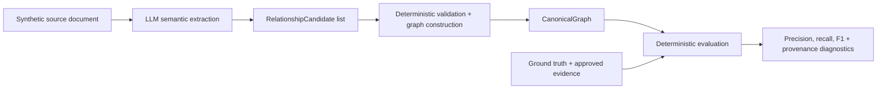
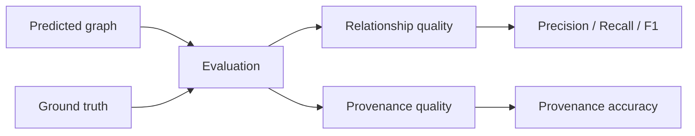

# Private Client Graph

Private Client Graph is an FTEC5660 MSc AI technical spike exploring whether an LLM can reconstruct **family and trust relationship graphs** from synthetic private-client-style documents while preserving **source provenance** and producing measurable evaluation results.

The project is deliberately benchmark-driven: start with a known answer key, generate realistic source material, extract relationships, build a canonical graph deterministically, and evaluate the result.

## Architecture



The LLM is responsible for semantic interpretation. Mechanically checkable work such as validation, entity construction, IDs, deduplication, canonicalisation, reference resolution, and scoring remains deterministic.

## Example generated graph

A canonical graph contains entities, relationships, and first-class evidence supporting those relationships:

```json
{
  "entities": [
    {"id": "entity_001", "type": "person", "name": "Alice Example"},
    {"id": "entity_002", "type": "person", "name": "Bob Example"},
    {"id": "entity_003", "type": "trust", "name": "Example Family Trust"}
  ],
  "relationships": [
    {"source": "entity_001", "type": "parent_of", "target": "entity_002", "evidence_ids": ["evidence_001"]},
    {"source": "entity_002", "type": "beneficiary_of", "target": "entity_003", "evidence_ids": ["evidence_002"]}
  ],
  "evidence": [
    {"id": "evidence_001", "document": "source.txt", "supporting_text": "Alice Example confirmed that she is Bob Example's parent."},
    {"id": "evidence_002", "document": "source.txt", "supporting_text": "Bob Example is a beneficiary of the Example Family Trust."}
  ]
}
```

## Current scope

Current entity types:

- `person`
- `trust`

Current relationship types:

- `parent_of`
- `sibling_of`
- `spouse_of`
- `settlor_of`
- `trustee_of`
- `beneficiary_of`

Current constraints:

- synthetic documents only;
- provenance is required for every extracted relationship;
- entity aliases, temporal state, contradictions, and richer graph semantics are deferred until benchmark cases require them.

## Quick start

Requires [uv](https://docs.astral.sh/uv/).

```bash
uv sync --locked
uv run pytest
```

For a live extraction, add `DEEPSEEK_API_KEY` to a local `.env` file:

```bash
uv run python -m private_client_graph.extract
```

Successful runs are saved under the Git-ignored `runs/` directory.

## Evaluation

```bash
uv run python -m private_client_graph.evaluate runs/case_01/<run>.json
```

The benchmark evaluates two dimensions: **relationship quality** and **provenance quality**.



| Metric | Meaning |
|---|---|
| **TP** | Correct relationship recovered |
| **FP** | Unsupported relationship predicted |
| **FN** | Ground-truth relationship missed |
| **Precision** | Of predicted relationships, how many were correct |
| **Recall** | Of expected relationships, how many were recovered |
| **F1** | Balance of precision and recall |
| **Provenance accuracy** | Of correct relationships, how many included at least one approved evidence span |

Relationship scoring compares semantic graph edges rather than generated graph IDs. Symmetric relationships such as `spouse_of` and `sibling_of` are treated equivalently in either direction. True negatives are not enumerated because the possible universe of non-existent relationships is open-ended.

Provenance is evaluated separately on true-positive relationships. Each ground-truth edge contains one or more human-approved exact evidence spans, and an edge passes provenance when at least one attached predicted evidence span matches one approved span.

## Repository layout

```text
private_client_graph/   Core extraction, graph construction, and evaluation code
cases/                  Synthetic benchmark cases and fixtures
tests/                  Unit and integration tests
docs/                   Project conventions and authoring workflows
runs/                   Local extraction/evaluation outputs (Git ignored)
```

## Design principles

- **LLM for semantics; deterministic code for mechanics.**
- **Answer key first.** Benchmark cases are designed from ground truth before source documents are written.
- **One new difficulty at a time.** New cases should make failures interpretable.
- **Architecture is earned by failures.** Add retries, verification, temporal state, entity resolution, or other complexity only when benchmark results justify it.
- **Refactors preserve behaviour.** Deterministic rules are protected by focused tests and required CI checks.

## Documentation

- [Synthetic case authoring workflow](docs/workflows/synthetic-case-authoring.md)
- [Code style](docs/CODE_STYLE.md)

## Status

Experimental MSc/hackathon research prototype. The current baseline covers a complete source → extraction → canonical graph → evaluation loop for Case 01, with additional cases intended to grow the benchmark and expose the next required capabilities.
