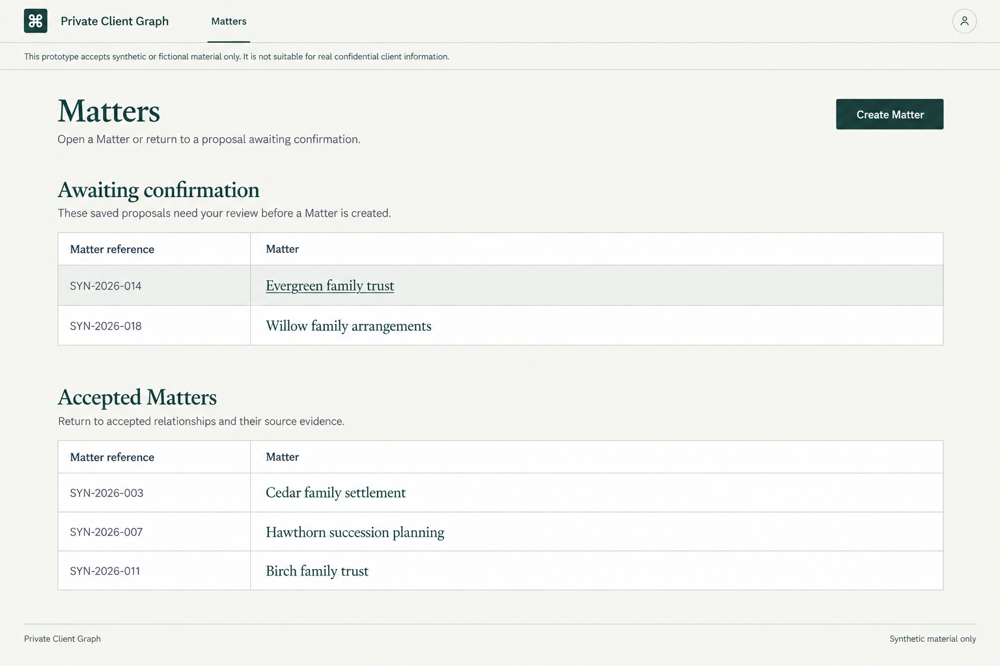
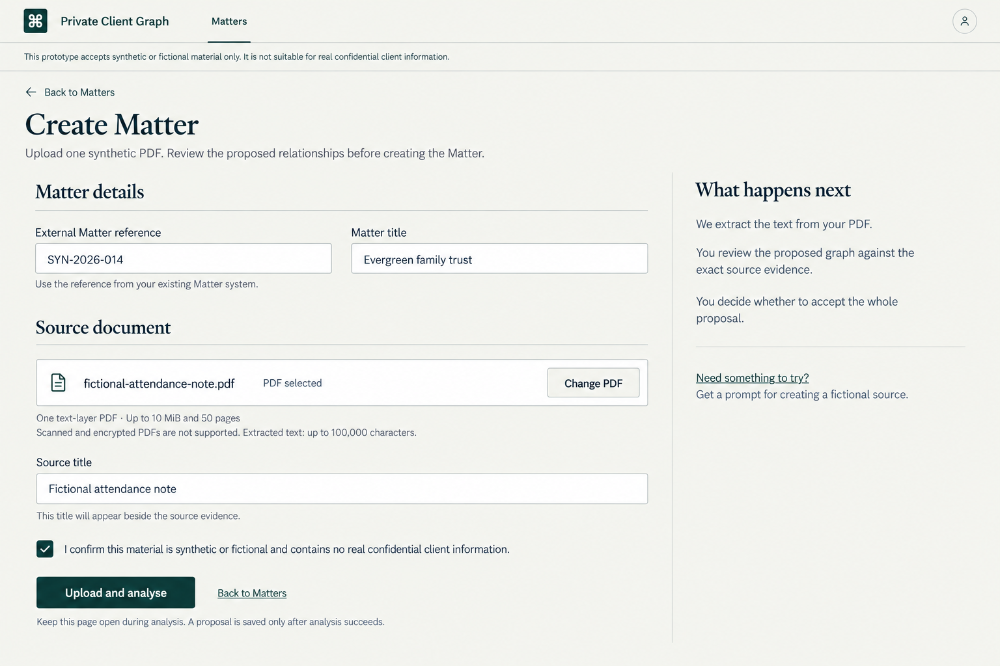
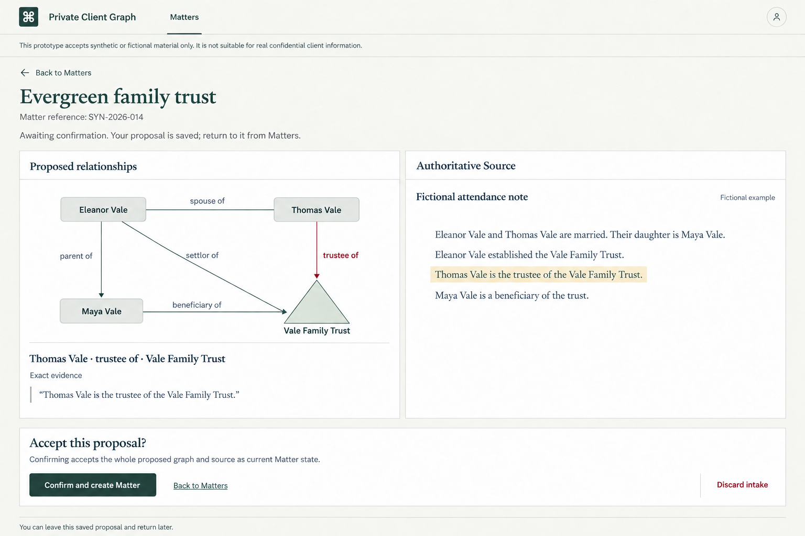
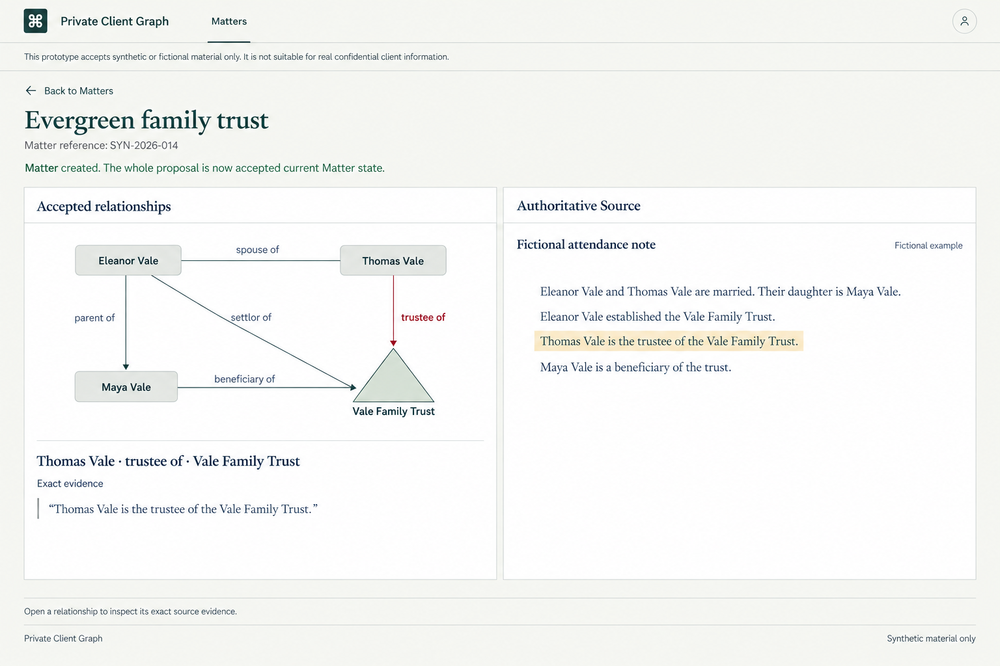
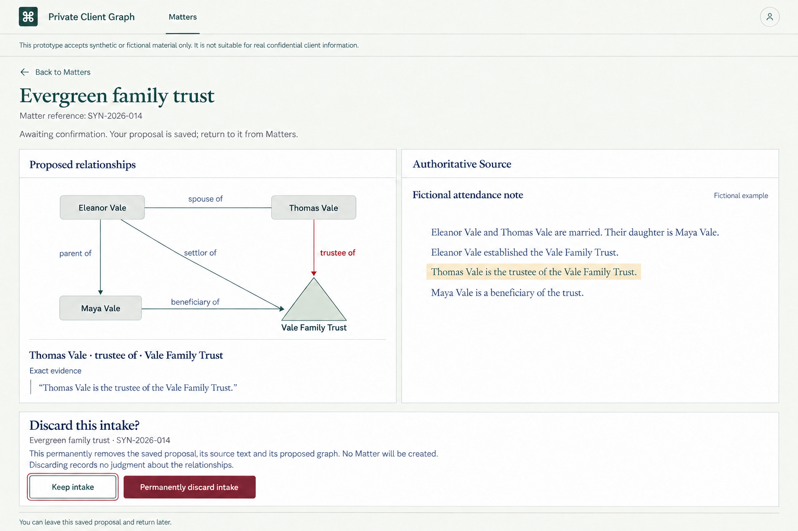
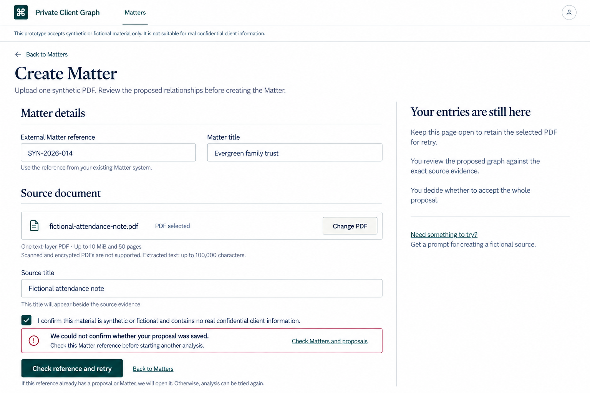
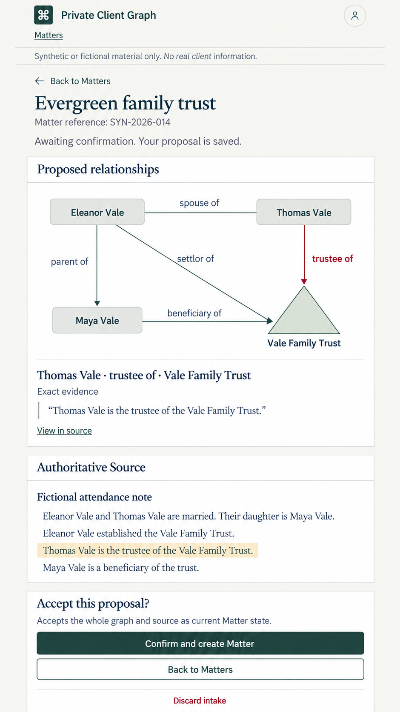

# Practitioner Matter workflow design

> **Status:** Approved design; application integration is not part of this PR.
>
> **Mode:** Operate. **Scope:** The end-to-end synthetic practitioner journey.

## Design authority

The approved direction extends the [Matter Ledger](matter-ledger-visual-spec.md):
aligned records, restrained typography, paper and white surfaces, deep green
actions, and exact source Evidence beside the graph. The product owner selected
graph-led review (direction A), requested upright triangles for Trusts, approved
the remaining workflow views, and approved the PC monogram separately.

The [Matter Intake specification](matter-intake-slice.md) and
[Matter workspace specification](practitioner-matter-workspace-slice.md) remain
authoritative for domain contracts, persistence, authentication, and acquisition.
This design changes presentation, not extraction, validation, identity,
canonicalisation, provenance, evaluation, or benchmark truth.

The images are composition references, not executable screens or ground truth.
Their fictional names and relationships are illustrative. Do not copy their
omitted edges or infer new relationships from their prose. The
[Trust-structure specification](trust-structure-presentation.md) governs graph
arrangement and connector meaning: Trust-role connectors remain labelled and
arrowless, despite arrowheads in some generated studies. Preserve one node per
canonical entity and all supplied relationships. Public illustration conventions
remain unchanged; the practitioner studies use rectangular people and triangular
Trusts, with Trust labels below the triangle.

Use the approved PC monogram instead of the placeholder Command-key symbol
visible in the raster studies. Exact fonts, colours, focus, and interactive
controls use the established Matter Ledger system, not raster approximations.

## Journey and navigation

```text
Matters
  -> Create Matter -> upload and analyse -> saved Matter Proposal
  -> open a saved Matter Proposal -> inspect graph and exact Evidence
       -> confirm the complete proposal -> accepted Matter
       -> return to Matters -> resume the saved proposal later
       -> confirm discard -> Matters
  -> open an accepted Matter -> inspect accepted graph and exact Evidence
```

Use dedicated pages for substantive intake and review. A saved proposal has a
stable route, supports refresh and direct re-entry, and is distinct from accepted
Matter state. This is not an absolute ban on dialogs: brief contextual tasks,
including the existing fictional-source prompt, can use them. The selected
discard design uses inline confirmation.

Routes remain `/app`, `/app/matter-proposals/new`,
`/app/matter-proposals/{proposal_id}`, and `/app/matters/{matter_id}`.
No intake draft is persisted before successful proposal creation. A separate
page does not imply autosave or file recovery after navigation.

## Approved views

Open the [local design gallery](assets/matter-workflows/index.html) for the full
sequence and interaction notes. The images below also render directly on GitHub.

### Matters

Place **Awaiting confirmation** before **Accepted Matters**. Both collections
use the same reference-and-title register; each row opens its resource. Keep
**Create Matter** as the primary page action. No assignee, dates, status chips,
counts, or row menus are added. Collection placement expresses the distinction.



### Intake

Group the form into **Matter details** and **Source document**. Preserve the
externally supplied reference, title, explicit source title, one supported PDF,
and synthetic-only confirmation. Show admission limits beside file selection.
The filename represents the browser's selected file, not a persisted document
or download resource. **Upload and analyse** prepares a proposal for review.



### Saved proposal review

Keep the graph and selected Evidence on the left and Authoritative Source on
the right. Selecting a relationship reveals and locates its exact supporting
passage. Explain that the proposal is saved and awaiting confirmation. Leaving
the page retains the proposal, not a record of individual review progress.

The decision area applies to the complete proposal: **Confirm and create
Matter**, **Back to Matters**, and a separate **Discard intake** action. Do not
present per-relationship acceptance or correction controls.



### Accepted Matter

Successful confirmation opens the accepted Matter with a brief success message.
Keep **Accepted relationships** visible on subsequent visits; do not repeat a
creation success message on ordinary return visits. Remove proposal decision
controls. The source and Evidence remain directly inspectable.



### Discard

Inline confirmation names the Matter title and reference and explains permanent
removal of the proposal, source, and graph. Discard creates no Matter and records
no judgment about the relationships. Start focus on **Keep intake**. Hide the
competing acceptance action during confirmation, disable conflicting terminal
actions while either request is pending, and restore focus on cancellation.
Navigate only after confirmed success; promise no undo.



### Uncertain-save recovery

Distinguish uncertainty from a known rollback. Preserve form values and the
locally selected file while the page remains open. **Check reference and retry**
resolves an existing proposal or Matter before another model invocation. Do not
claim nothing was saved when the outcome is unknown.



### Narrow screens

Stack graph, selected Evidence, source, and decision controls. **View in source**
moves focus to the exact highlighted passage; provide a return route to the
selected relationship. Keep graph labels readable with pan/zoom and accessible
relationship controls rather than shrinking the entire desktop diagram. Decision
controls stay in document flow and do not cover source text. On the collection
page, stack reference and title within each ruled row. On intake, stack fields
and move secondary guidance below the primary task.



## Supporting states

| State | Required behaviour |
| --- | --- |
| Empty collections | Retain headings, truthful empty messages, and Create Matter. No fabricated rows. |
| Loading or collection failure | Use textual state messages within each register; a failed collection does not hide the other. Offer reload on failure. |
| Analysis pending | Keep inputs visible, prevent repeated submission, and announce uploading/analysis. No invented percentages, stages, or saved-draft claim. |
| Invalid file or metadata | Associate errors with fields, focus an error summary, and retain other inputs. Explain the actual admission failure. |
| Empty proposed graph | Say analysis completed with no proposed relationships. Keep the source and whole-proposal decision available. This is not analysis failure. |
| Duplicate reference | Open the existing resource with an explanation; preserve the authoritative cross-resource uniqueness contract. |
| Retryable failure | Offer explicit retry after reference resolution; no automatic model retries. |
| Analysis unavailable or allowance exhausted | Explain availability or the server-provided reset time. Existing review and terminal operations remain available. |
| Session expiry | Offer sign-in and return to the requested saved resource where supported; do not promise local form or file persistence across navigation. |
| Missing proposal | Explain that it is no longer available and return to current collections; do not invent who acted on it. |
| Terminal-action failure | Keep context, report known versus uncertain outcomes honestly, and navigate only after confirmed success. |

All primary controls have at least 44px targets, visible keyboard focus, and
textual state feedback. Source text remains selectable, and colour alone never
identifies selection, errors, or acceptance. Long names wrap without clipping.

## Approved brand assets

The selected **PC monogram** replaces the placeholder symbol while retaining the
Private Client Graph name. It is authored as vector geometry rather than a font
glyph or a cropped generated image. The shared upright and open counters keep
the P and C distinct. The primary ink is `#173E38`.

| Asset | Use |
| --- | --- |
| [Primary SVG](assets/brand/pc-monogram.svg) | Light application header; roughly 28px wide by 34px high beside the product name. |
| [White SVG](assets/brand/pc-monogram-reverse.svg) | Dark backgrounds. |
| [Favicon SVG](assets/brand/favicon.svg) | Square icon with a green ground and white monogram. |

The adjacent product name supplies the accessible name in a header link; mark
the redundant icon decorative in that usage. Preserve the SVG view box and
aspect ratio. The logo has been visually previewed at header and small icon
sizes; this approval is not a trademark-clearance claim.

## Scope and implementation handoff

This design supersedes the older Ledger specification only for the collection
order/headings, intake and decision presentation, responsive review additions,
and replacement brand mark described here. Keep its remaining tokens and shell
rules. The persistent boundary now says synthetic-only; intake is not read-only.
The public landing composition and its typography are not redesigned here.

Remain synthetic-only. No real-client handling, graph editing, source replacement,
multiple sources, assignments, archiving, or new domain semantics are approved.
Implementation must retain the existing authentication and data-handling gates.

A later implementation should cover the actual behavioural changes with focused
tests, preserve the deterministic model-boundary substitution strategy, run the
required backend/frontend checks, and verify desktop/mobile and keyboard flows.
This PR ships documentation and artwork only; it installs no application assets,
changes no API, and adds no migration.

The PNG sidecars retain generation prompts and approval provenance. Only selected
final views are included; rejected alternatives and intermediate renders remain
local.
