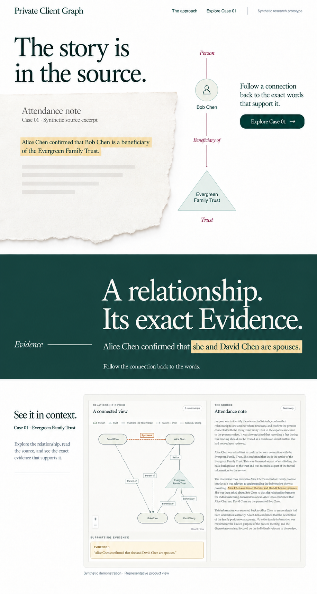

# Public landing visual direction: Evidence Folio

**Status:** Visual direction and scoped implementation authorized in conversation.
The approved hero, Evidence chapter, and contained Case 01 demonstration are
implemented. This is a presentation change, not a production-readiness claim.

This direction replaces the visual composition in
[Public landing experience](public-landing-experience.md). The approved scope is
the hero, one narrative chapter, and a contained Case 01 demonstration stage.
The remaining landing-page sections are outside this approval.

## Composition

- **Hero:** A light, document-led editorial composition. A source excerpt on warm
  paper sits beside a purpose-built Person/Trust illustration and a sparse
  invitation to explore Case 01. The hero does not reuse `GraphView` or a product
  screenshot.
- **Evidence chapter:** A full-width deep ledger-green panel creates a deliberate
  chapter break. Large warm-white typography, an asymmetric margin note, and one
  exact source passage carry the idea: “A relationship. Its exact Evidence.”
  Gold highlights only supporting Evidence.
- **Demonstration:** Return to a light surface. Place the existing graph, Evidence,
  source document, and relationship selection experience inside a bounded frame
  with visible outer margins. Retain the actual product UI.

Keep one dominant idea per chapter, substantial negative space, and clear
full-width surface transitions. Later sections may inherit this visual grammar
when separately scoped.

## Identity and fidelity

Use Newsreader and Public Sans, deep ledger green (`#173e38`), warm paper
(`#f6f6f1`), white, restrained burgundy (`#773b46`), and Evidence gold. Preserve the
Trust triangle and professional source treatment.

The image was generated with the built-in image-generation tool and approved in
conversation. Its generation prompt is embedded in the PNG. It establishes
composition and art direction; generated text and product details are not new
contracts. Any implementation must use exact synthetic source excerpts and the
real existing product components. Trust-role connectors have no arrowheads or
implied flow. Do not reproduce generated artifacts or infer new functionality,
claims, relationship semantics, or source facts from the image.

The source of product truth remains [PRODUCT.md](../../PRODUCT.md), the glossary,
and existing application contracts. No production readiness, adoption, accuracy,
or security claims are approved here.

## Implementation handoff

`LandingHero` implements the paper excerpt, independent editorial Person/Trust
notation, and Case 01 anchor. `EvidenceChapter` implements the green chapter and
exact spouse Evidence. `ShowcaseDemonstration` contains the existing
`ReviewWorkspace`, `SourcePanel`, `AnalysisControls`, and `useCaseAnalysis`
workflow. It initially displays the synthetic source; sample or live analysis is
an explicit user action. Relationship selection and exact Evidence inspection
remain the real review experience, with execution mode visible below the frame.

The approved comp remains the visual source of truth. Intentional adaptations
needed to preserve product truth and usable responsive behavior are:

- The hero presents the actual Case 01 attendance-note passage, not the invented
  letter treatment or generated wording in the comp. Its readable text is HTML
  over a decorative paper image.
- The editorial illustration depicts Bob Chen's beneficiary relationship to the
  Evergreen Family Trust using a Trust triangle and connectors without arrows.
- The demonstration retains its loading, availability, error, and explicit
  analysis controls. These working states take precedence over static comp text.
- At 1100px the demonstration caption moves above the frame to preserve review
  width. At mobile widths the hero and chapter reflow, and frame insets tighten
  while the shared workspace retains its responsive behavior.

Self-hosted shared fonts now live under `web/src/styles/`. Public typography uses
Newsreader Display weight 400, normal and italic, alongside Public Sans. The
existing Newsreader weight 500 practitioner face is preserved. Neither shell
needs a cross-feature font import.

[DESIGN.md](../../DESIGN.md) records the implemented public tokens and their
application boundaries. The local `.impeccable/design.json` sidecar provides
visual tooling extensions and remains ignored by Git. These records do not
approve later landing sections, practitioner redesign, domain-contract changes,
or non-synthetic data capabilities.
